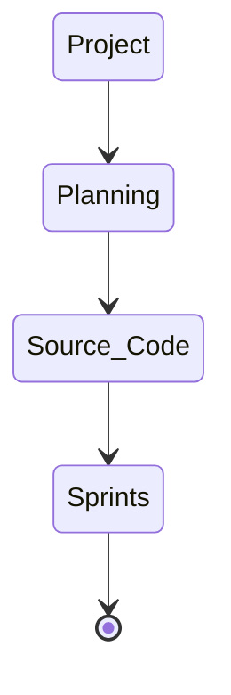

# CMPG-323-Overview---21088799
CMPG323 - Project1

## Repositories per project:
Project 1- Create Public Github Repository  
Project 2- API Development  
Project 3- Standards and Patterns    
Project 4- Testing & RPA    
Project 5- Reporting & Monitoring    
  
## Project Repository Integration Diagram 

## Branching Strategy
For each project the Git Flow principle will be used. Meaning there will be a Master Branch and Development branches.  
All production and testing will be done on development branches before commiting the changes to the Master branch.  
The Master branch will then be submitted as the final product.  
  
