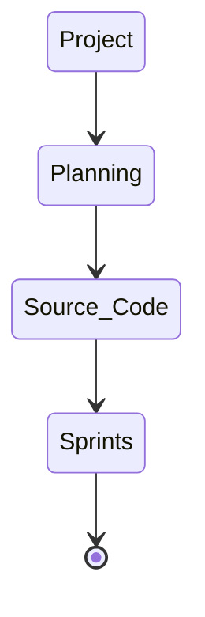

# CMPG-323-Overview---21088799

## Repositories per project:
Project 1- Create Public Github Repository  
Project 2- API Development  
Project 3- Standards and Patterns    
Project 4- Testing & RPA    
Project 5- Reporting & Monitoring    
  
## Project Repository Integration Diagram 

## Branching Strategy
For each project the Git Flow principle will be used. Meaning there will be a Master Branch and Development branches.  
All production and testing will be done on development branches before commiting the changes to the Master branch.  
The Master branch will then be submitted as the final product.  
  
## .gitignore  
The .gitignore file will be added to each project and mainly used to exclude all development testing, system files and other resources  
used during the project development that should not form part of the final solution.  
  
## Storing of credentials and sensitive information
No sensitive information or credentials will be stored on any of the repositories to ensure the privacy of the information.  
An alternative to storing said information will be used in the form of using the Github Actions secret to store the information.
  
